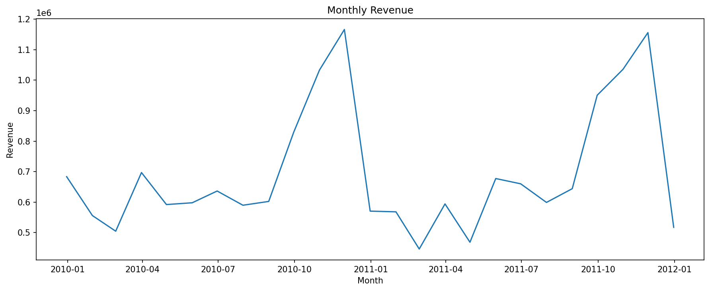
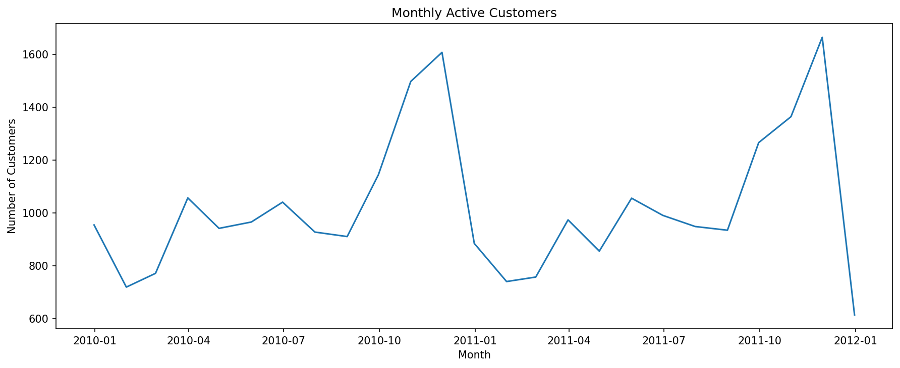
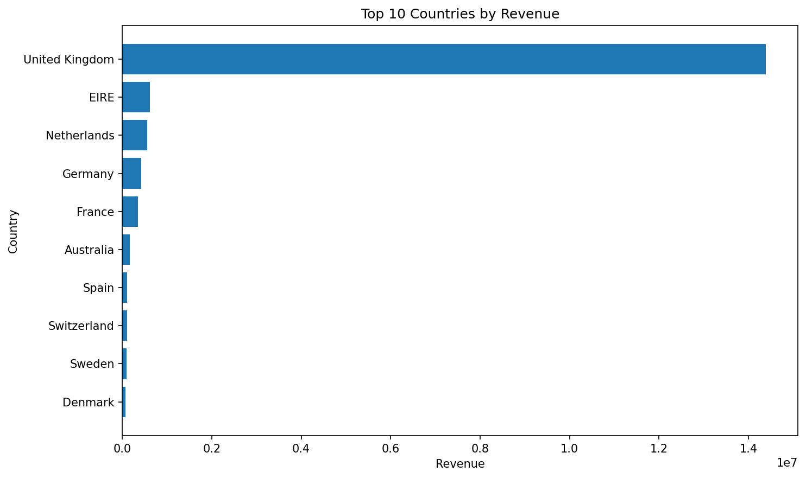
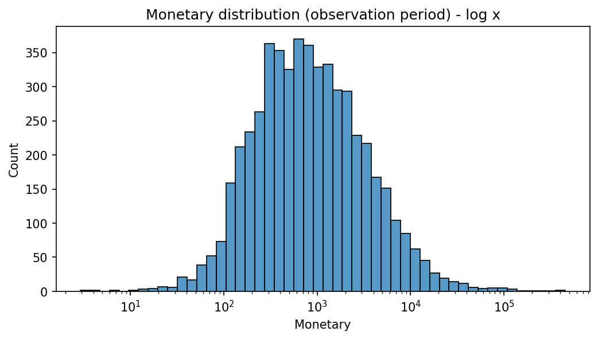
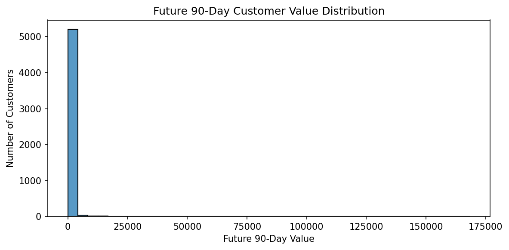

# Customer Lifetime Value Prediction

This project focuses on predicting Customer Lifetime Value (CLV) using retail transaction data.

The goal is to understand customer purchasing behaviour, prepare the transaction data, and later build a model that predicts the future value of each customer.

## Project Stages

1. ✅ Data Understanding, Cleaning & Customer Behaviour Analysis
2. ✅ Customer-Level Feature Engineering & CLV Target Creation
3. CLV Prediction Model
4. Model Evaluation & Business Insights

---

# Part 01 - Data Understanding, Cleaning & Customer Behaviour Analysis

Part 01 focused on understanding the raw retail transaction data, investigating data-quality issues, cleaning the transaction records, and exploring customer purchasing behaviour before moving to customer-level CLV analysis.

## Work Completed

- Loaded the Excel workbook and inspected both yearly sheets
- Checked the structure and data types of each sheet
- Checked missing values
- Checked exact duplicate rows
- Investigated cancelled transactions using the `C` invoice prefix
- Compared cancelled invoices with negative-quantity records
- Checked zero and negative quantities
- Checked zero and negative unit prices
- Inspected special negative-price `Adjust bad debt` records
- Combined both yearly sheets into one transaction dataset
- Created a separate cleaned transaction dataset
- Removed exact duplicate rows
- Removed cancelled invoices
- Removed transactions without a `Customer ID`
- Kept only positive quantities
- Kept only positive unit prices
- Converted `Customer ID` to integer after missing values were removed
- Created `TotalPrice` as `Quantity × Price`
- Validated the cleaned transaction dataset
- Created customer-level purchasing summaries
- Reviewed top customers by total spend
- Analysed purchasing behaviour by country
- Analysed monthly transaction value
- Analysed monthly active customers
- Saved the cleaned transaction dataset for the next stage

## Dataset

The supplied Excel workbook contains two transaction sheets:

- `Year 2009-2010`
- `Year 2010-2011`

Both sheets contain:

- `Invoice`
- `StockCode`
- `Description`
- `Quantity`
- `InvoiceDate`
- `Price`
- `Customer ID`
- `Country`

The two sheets contain a combined **1,067,371 raw transaction records**.

## Cleaning Results

| Metric                     |        Result |
| -------------------------- | ------------: |
| Raw combined rows          |     1,067,371 |
| Cleaned rows               |       779,425 |
| Rows removed               |       287,946 |
| Percentage removed         |        26.98% |
| Unique customers           |         5,878 |
| Unique invoices            |        36,969 |
| Recorded transaction value | 17,374,804.27 |

The cleaned transaction period runs from **1 December 2009 to 9 December 2011**.

Final validation returned zero remaining:

- Missing `Customer ID`
- Duplicate rows
- Non-positive quantities
- Non-positive prices
- Missing values

The raw `online_retail_dataset.xlsx` file was kept unchanged. Cleaning was performed on a working copy.

## Part 01 Visuals

### Monthly Transaction Value



### Monthly Active Customers



### Top 10 Countries by Transaction Value



---

# Part 02 - Customer-Level Feature Engineering & CLV Target Creation

Part 02 converts the cleaned transaction data into a customer-level dataset with one row per customer.

The main goal was to describe each customer's historical behaviour and then create a future-value target that can be used later for CLV modelling.

## Time-Based Feature and Target Setup

A time-based split was used so that historical customer behaviour is kept separate from future customer value.

The latest transaction in the cleaned dataset was:

```text
2011-12-09 12:50:00
```

A 90-day future window was used.

The cutoff date was:

```text
2011-09-10 12:50:00
```

Customer features were calculated from transactions up to the cutoff date.

The future target was calculated from transactions after the cutoff date and within the 90-day future period.

The observation period ended at:

```text
2011-09-09 15:53:00
```

The future period contained transactions from:

```text
2011-09-11 10:35:00
```

to:

```text
2011-12-09 12:50:00
```

## Order-Level Preparation

The observation-period transaction lines were first converted into order-level data.

The final order-level dataset contained:

- **30,343 orders**
- **30,343 unique invoices**
- One row per invoice
- No missing values

During the invoice consistency check, no invoice was linked to more than one customer.

A small number of invoices had more than one recorded timestamp, so the earliest timestamp was used as the order date when building the final order-level dataset.

## Customer-Level Features

The customer-level dataset was created for customers with historical activity before the cutoff.

This resulted in **5,281 customers**.

The following features were created:

| Feature             | Meaning                                                      |
| ------------------- | ------------------------------------------------------------ |
| `Recency`           | Days since the customer's most recent purchase at the cutoff |
| `Frequency`         | Number of unique orders during the observation period        |
| `Monetary`          | Total order value during the observation period              |
| `AvgOrderValue`     | Average order value                                          |
| `PurchaseFrequency` | Orders per active day                                        |
| `ProductDiversity`  | Number of unique products purchased                          |
| `Tenure_days`       | Days from first purchase to the cutoff                       |
| `Tenure_months`     | Approximate customer tenure in months                        |
| `active_days`       | Number of days from first purchase through the cutoff        |

## Future CLV Target

The future period was aggregated at customer level to create:

- `Future_90d_Orders`
- `Future_90d_Value`

`Future_90d_Value` is the main target for the later CLV prediction stage.

Out of the 5,281 customers with historical activity:

- **2,292 customers** made at least one purchase during the future 90-day period
- **2,989 customers** had no recorded purchase during the future period

A simple exploratory check found a Spearman correlation of **0.502** between historical `Monetary` and `Future_90d_Value`.

This was used only as an exploratory check and not as a model result.

## Final Customer-Level Dataset

The final CLV dataset contains:

- **5,281 customer records**
- **14 columns**

The final columns are:

```text
CustomerID
first_purchase_date
last_purchase_date
Recency
Tenure_days
Tenure_months
active_days
Frequency
Monetary
AvgOrderValue
PurchaseFrequency
ProductDiversity
Future_90d_Orders
Future_90d_Value
```

The processed customer-level dataset was saved as:

```text
data/processed/customer_clv_dataset.csv
```

## Part 02 Visuals

### Monetary Distribution



### Future 90-Day Customer Value Distribution



These plots were created to inspect the customer-level feature and target distributions before moving to the modelling stage.

## Current Status

✅ **Part 01 - Data Understanding, Cleaning & Customer Behaviour Analysis is complete.**

✅ **Part 02 - Customer-Level Feature Engineering & CLV Target Creation is complete.**

The customer-level CLV dataset is ready for the next stage.

## Next Stage

The next stage will focus on **CLV Prediction Model**, using the customer-level features to predict `Future_90d_Value`.

## Project Structure

```text
customer-lifetime-value/
│
├── data/
│   ├── raw/
│   │   └── online_retail_dataset.xlsx
│   └── processed/
│       ├── cleaned_transactions.csv
│       └── customer_clv_dataset.csv
│
├── images/
│   ├── 01_monthly_revenue.png
│   ├── 02_monthly_active_customers.png
│   ├── 03_top_countries_by_revenue.png
│   ├── 04_monetary_distribution.png
│   └── 05_future_90d_value_distribution.png
│
├── notebooks/
│   ├── 01_data_understanding_cleaning.ipynb
│   └── 02_customer_level_feature_engineering.ipynb
│
├── README.md
├── SUMMARY.md
├── CHANGE_LOG.md
├── requirements.txt
└── .gitignore
```
