# Customer Lifetime Value Prediction

This project focuses on predicting Customer Lifetime Value (CLV) using retail transaction data.

The goal is to understand customer purchasing behaviour, prepare the transaction data, and later build a model that predicts the future value of each customer.

## Project Stages

1. ✅ Data Understanding, Cleaning & Customer Behaviour Analysis
2. ✅ Customer-Level Feature Engineering & CLV Target Creation
3. ✅ CLV Prediction Model
4. ✅ Model Tuning, Interpretability & Customer Value Analysis

---

# Part 01 - Data Understanding, Cleaning & Customer Behaviour Analysis

Part 01 focused on understanding the raw retail transaction data, investigating data-quality issues, cleaning the transaction records, and exploring customer purchasing behaviour before moving to customer-level CLV analysis.

## Work Completed

- Loaded the Excel workbook and inspected both yearly sheets
- Checked the structure and data types of each sheet
- Checked missing values
- Checked exact duplicate rows
- Investigated cancelled transactions using the `C` invoice prefix
- Compared cancelled invoices with negative-quantity records
- Checked zero and negative quantities
- Checked zero and negative unit prices
- Inspected special negative-price `Adjust bad debt` records
- Combined both yearly sheets into one transaction dataset
- Created a separate cleaned transaction dataset
- Removed exact duplicate rows
- Removed cancelled invoices
- Removed transactions without a `Customer ID`
- Kept only positive quantities
- Kept only positive unit prices
- Converted `Customer ID` to integer after missing values were removed
- Created `TotalPrice` as `Quantity × Price`
- Validated the cleaned transaction dataset
- Created customer-level purchasing summaries
- Reviewed top customers by total spend
- Analysed purchasing behaviour by country
- Analysed monthly transaction value
- Analysed monthly active customers
- Saved the cleaned transaction dataset for the next stage

## Dataset

The supplied Excel workbook contains two transaction sheets:

- `Year 2009-2010`
- `Year 2010-2011`

Both sheets contain:

- `Invoice`
- `StockCode`
- `Description`
- `Quantity`
- `InvoiceDate`
- `Price`
- `Customer ID`
- `Country`

The two sheets contain a combined **1,067,371 raw transaction records**.

## Cleaning Results

| Metric                     |        Result |
| -------------------------- | ------------: |
| Raw combined rows          |     1,067,371 |
| Cleaned rows               |       779,425 |
| Rows removed               |       287,946 |
| Percentage removed         |        26.98% |
| Unique customers           |         5,878 |
| Unique invoices            |        36,969 |
| Recorded transaction value | 17,374,804.27 |

The cleaned transaction period runs from **1 December 2009 to 9 December 2011**.

Final validation returned zero remaining:

- Missing `Customer ID`
- Duplicate rows
- Non-positive quantities
- Non-positive prices
- Missing values

The raw `online_retail_dataset.xlsx` file was kept unchanged. Cleaning was performed on a working copy.

## Part 01 Visuals

### Monthly Transaction Value


### Monthly Active Customers


### Top 10 Countries by Transaction Value


---

# Part 02 - Customer-Level Feature Engineering & CLV Target Creation

Part 02 converts the cleaned transaction data into a customer-level dataset with one row per customer.

The main goal was to describe each customer's historical behaviour and then create a future-value target that can be used later for CLV modelling.

## Time-Based Feature and Target Setup

A time-based split was used so that historical customer behaviour is kept separate from future customer value.

The latest transaction in the cleaned dataset was:

```text
2011-12-09 12:50:00
```

A 90-day future window was used.

The cutoff date was:

```text
2011-09-10 12:50:00
```

Customer features were calculated from transactions up to the cutoff date.

The future target was calculated from transactions after the cutoff date and within the 90-day future period.

The observation period ended at:

```text
2011-09-09 15:53:00
```

The future period contained transactions from:

```text
2011-09-11 10:35:00
```

to:

```text
2011-12-09 12:50:00
```

## Order-Level Preparation

The observation-period transaction lines were first converted into order-level data.

The final order-level dataset contained:

- **30,343 orders**
- **30,343 unique invoices**
- One row per invoice
- No missing values

During the invoice consistency check, no invoice was linked to more than one customer.

A small number of invoices had more than one recorded timestamp, so the earliest timestamp was used as the order date when building the final order-level dataset.

## Customer-Level Features

The customer-level dataset was created for customers with historical activity before the cutoff.

This resulted in **5,281 customers**.

The following features were created:

| Feature             | Meaning                                                      |
| ------------------- | ------------------------------------------------------------ |
| `Recency`           | Days since the customer's most recent purchase at the cutoff |
| `Frequency`         | Number of unique orders during the observation period        |
| `Monetary`          | Total order value during the observation period              |
| `AvgOrderValue`     | Average order value                                          |
| `PurchaseFrequency` | Orders per active day                                        |
| `ProductDiversity`  | Number of unique products purchased                          |
| `Tenure_days`       | Days from first purchase to the cutoff                       |
| `Tenure_months`     | Approximate customer tenure in months                        |
| `active_days`       | Number of days from first purchase through the cutoff        |

## Future CLV Target

The future period was aggregated at customer level to create:

- `Future_90d_Orders`
- `Future_90d_Value`

`Future_90d_Value` is the main target for the later CLV prediction stage.

Out of the 5,281 customers with historical activity:

- **2,292 customers** made at least one purchase during the future 90-day period
- **2,989 customers** had no recorded purchase during the future period

A simple exploratory check found a Spearman correlation of **0.502** between historical `Monetary` and `Future_90d_Value`.

This was used only as an exploratory check and not as a model result.

## Final Customer-Level Dataset

The final CLV dataset contains:

- **5,281 customer records**
- **14 columns**

The final columns are:

```text
CustomerID
first_purchase_date
last_purchase_date
Recency
Tenure_days
Tenure_months
active_days
Frequency
Monetary
AvgOrderValue
PurchaseFrequency
ProductDiversity
Future_90d_Orders
Future_90d_Value
```

The processed customer-level dataset was saved as:

```text
data/processed/customer_clv_dataset.csv
```

## Part 02 Visuals

### Monetary Distribution


### Future 90-Day Customer Value Distribution


These plots were created to inspect the customer-level feature and target distributions before moving to the modelling stage.

# Part 03 - CLV Prediction Model Development & Evaluation

Part 03 uses the customer-level dataset from Part 02 to predict `Future_90d_Value` using historical customer behaviour.

## Modelling Approach

The modelling dataset used these historical customer features:

- `Recency`
- `Tenure_days`
- `Tenure_months`
- `active_days`
- `Frequency`
- `Monetary`
- `AvgOrderValue`
- `PurchaseFrequency`
- `ProductDiversity`

The following fields were excluded from the model inputs:

- `CustomerID`
- `first_purchase_date`
- `last_purchase_date`
- `Future_90d_Value`
- `Future_90d_Orders`

`Future_90d_Orders` was excluded because it comes from the same future period as the target and would introduce future information into the model.

The data was split into training and test sets using an 80/20 split with `random_state=42`.

## Models

Three regression models were compared:

- DummyRegressor mean baseline
- Random Forest Regressor
- XGBoost Regressor

The models were evaluated on the same test set using:

- MAE
- RMSE
- R²

## Model Results

| Model             |        MAE |        RMSE |         R² |
| ----------------- | ---------: | ----------: | ---------: |
| Baseline          |     873.34 |     5725.76 |    -0.0006 |
| **Random Forest** | **592.08** | **5662.33** | **0.0214** |
| XGBoost           |     638.70 |     5939.51 |    -0.0767 |

Random Forest performed best across all three metrics and was selected as the best-performing model for this project.

The relatively low R² indicates that the model explains only a small portion of the variation in future customer value. The future CLV target is highly skewed, with many customers having zero future value and a smaller number of very high-value customers.

## Random Forest Feature Importance

The most important features were:

| Feature           | Importance |
| ----------------- | ---------: |
| **Monetary**      | **0.7671** |
| **AvgOrderValue** | **0.1110** |
| ProductDiversity  |     0.0306 |
| PurchaseFrequency |     0.0218 |
| Recency           |     0.0212 |
| Frequency         |     0.0196 |
| active_days       |     0.0115 |
| Tenure_days       |     0.0088 |
| Tenure_months     |     0.0082 |

`Monetary` was by far the most important feature used by the Random Forest model, followed by `AvgOrderValue`.

Feature importance indicates how useful a feature was to the trained model; it does not establish a causal relationship.

## Part 03 Visuals

### Model Comparison - MAE

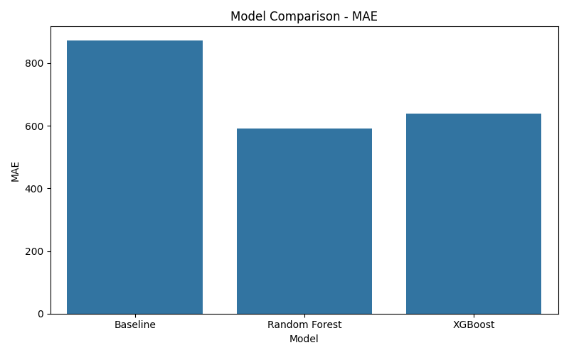

### Model Comparison - RMSE

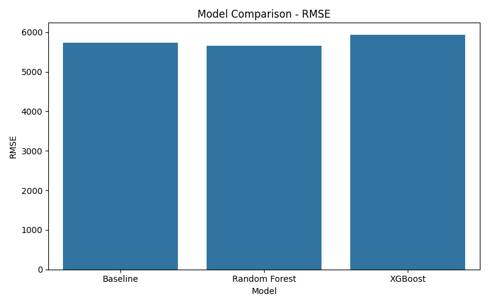

### Model Comparison - R²

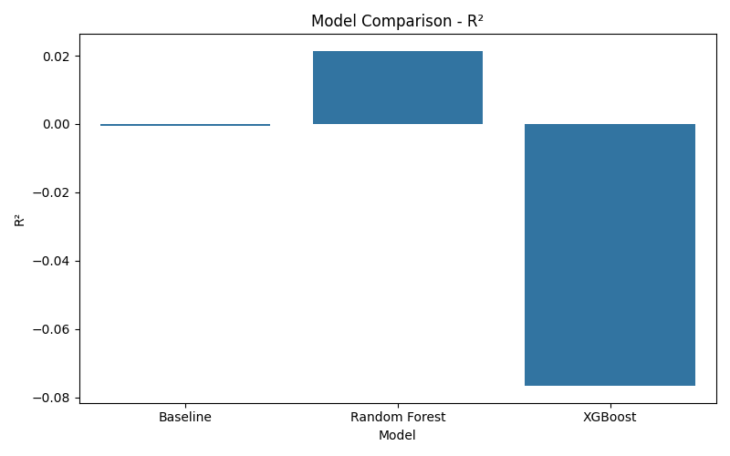

### Random Forest - Actual vs Predicted CLV

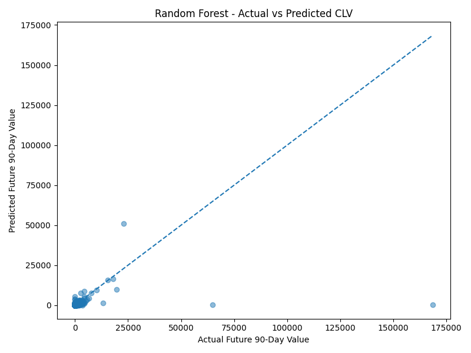

### Random Forest Feature Importance

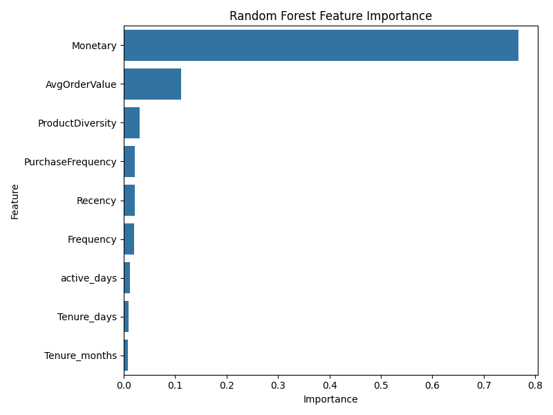

## Part 03 Output

The modelling notebook is:

```text
notebooks/03_clv_prediction_model.ipynb
```

---

# Part 04 - Model Tuning, Interpretability & Customer Value Analysis

Part 04 focused on improving the strongest model from Part 03, understanding why the model makes its predictions, and using the predicted CLV values to group customers into practical value segments.

## Model Tuning

The Random Forest from Part 03 was rebuilt using the same feature set and 80/20 train-test split.

The model was tuned using **5-fold cross-validation** with `RandomizedSearchCV`.

The search tested 20 randomly selected hyperparameter combinations across the five folds.

### Best Hyperparameters

| Parameter           | Value |
| ------------------- | ----: |
| `n_estimators`      |   300 |
| `max_depth`         |    10 |
| `min_samples_split` |     5 |
| `min_samples_leaf`  |     4 |
| `max_features`      |   1.0 |

The best cross-validation MAE was **447.26**.

### Original vs Tuned Random Forest

| Model                   |        MAE |        RMSE |         R² |
| ----------------------- | ---------: | ----------: | ---------: |
| Original Random Forest  |     592.08 |     5662.33 |     0.0214 |
| **Tuned Random Forest** | **576.78** | **5622.81** | **0.0350** |

The tuned model improved:

- MAE by **2.59%**
- RMSE by **0.70%**
- R² by **0.0136**

The improvement was modest, but it was consistent across all three test-set metrics.

## Model Interpretability

The tuned Random Forest was analysed using:

- built-in feature importance
- permutation importance
- partial dependence analysis

### Feature Importance

The tuned Random Forest's built-in feature importance showed:

| Feature           | Importance |
| ----------------- | ---------: |
| **Monetary**      | **0.9266** |
| Recency           |     0.0162 |
| ProductDiversity  |     0.0161 |
| Frequency         |     0.0123 |
| AvgOrderValue     |     0.0094 |
| PurchaseFrequency |     0.0089 |
| Tenure_days       |     0.0044 |
| active_days       |     0.0035 |
| Tenure_months     |     0.0027 |

`Monetary` was by far the strongest feature.

Permutation importance also ranked `Monetary` first, followed by `Recency`.

### Model Behaviour

Partial dependence analysis showed three main relationships:

- Higher historical `Monetary` was generally associated with higher predicted CLV.
- Higher `Recency` was generally associated with lower predicted CLV.
- Higher `PurchaseFrequency` was generally associated with higher predicted CLV.

These are model relationships and should not be treated as causal effects.

## Customer Value Analysis

The tuned model was used to generate predicted 90-day CLV for all **5,281 customers**.

A final customer scoring table was created containing:

- `CustomerID`
- `Future_90d_Value`
- `Predicted_90d_Value`
- `Value_Segment`

The scoring output was saved as:

```text
data/processed/customer_clv_predictions.csv
```

## Customer Value Segmentation

Customers were grouped using their predicted 90-day CLV:

- **Low:** bottom 50%
- **Medium:** 50th–80th percentile
- **High:** 80th–95th percentile
- **VIP:** top 5%

### Segment Results

| Segment | Customers | Customer Share | Predicted Value Share | Actual Value Share |
| ------- | --------: | -------------: | --------------------: | -----------------: |
| Low     |     2,641 |         50.01% |                 7.83% |             11.35% |
| Medium  |     1,584 |         29.99% |                17.15% |             16.92% |
| High    |       792 |         15.00% |                24.71% |             22.44% |
| **VIP** |   **264** |      **5.00%** |            **50.32%** |         **49.29%** |

The strongest business finding was that the **top 5% of customers represented about half of both predicted and observed future customer value**.

### Customer Behaviour by Segment

The VIP segment showed much stronger historical behaviour than the other groups:

| Measure           |    Low |   Medium |     High |       VIP |
| ----------------- | -----: | -------: | -------: | --------: |
| Recency           | 318.68 |   122.72 |    60.33 |     41.14 |
| Frequency         |   2.06 |     4.79 |    10.74 |     33.42 |
| Monetary          | 461.26 | 1,471.99 | 4,422.16 | 26,054.47 |
| AvgOrderValue     | 240.70 |   387.27 |   541.19 |  1,032.19 |
| PurchaseFrequency |   0.01 |     0.02 |     0.03 |      0.06 |
| ProductDiversity  |  29.96 |    75.86 |   158.27 |    257.77 |
| Tenure_days       | 427.84 |   390.84 |   479.29 |    574.12 |

VIP customers were generally more recent, more frequent, higher-spending, higher-order-value, more product-diverse, and longer-tenured.

## Business Recommendations

### 1. Protect VIP customers

VIP customers represent a large share of future customer value, so retention efforts should prioritise this group.

### 2. Move High-value customers toward VIP

High-value customers already show strong behaviour. Loyalty, cross-sell, and upsell activity can focus on increasing purchase frequency and average order value.

### 3. Reactivate customers with high recency

Customers who have gone a long time without purchasing tend to have lower predicted CLV. Reactivation campaigns can focus on customers who still have meaningful historical value.

### 4. Use lower-cost campaigns for Low-value customers

The Low segment contains about half of the customer base but only 7.83% of predicted future value. Lower-cost or automated campaigns may be more appropriate for this group.

## Model Limitation

The tuned Random Forest improved on the original model, but overall predictive performance remains limited.

The final test-set R² was **0.0350**, so the model explains only a small portion of the variation in future customer value.

The future CLV target is highly skewed, with many zero-value customers and a smaller number of very high-value customers.

The model should therefore be used mainly as a **customer prioritisation tool**, rather than as an exact revenue forecast for every individual customer.

## Part 04 Visuals

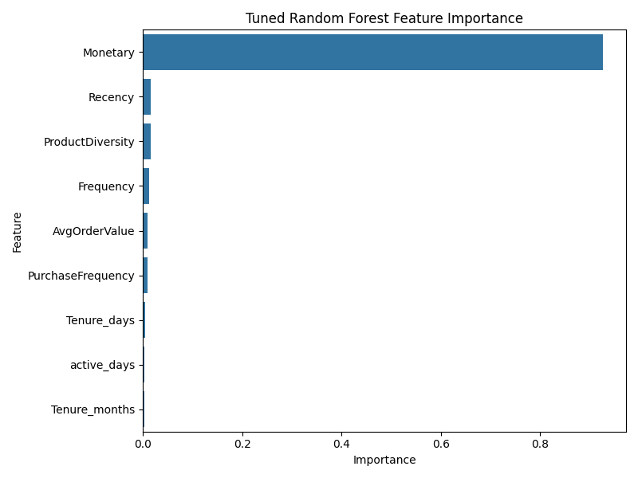

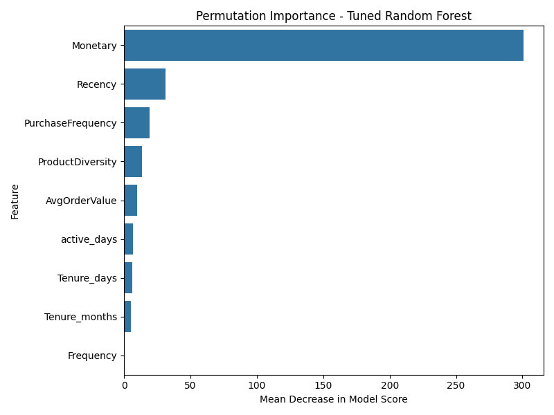

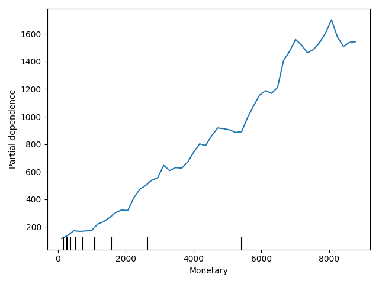

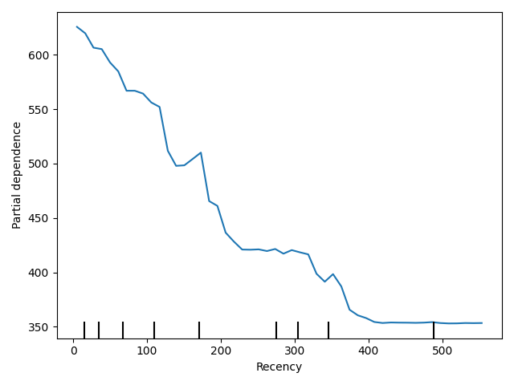

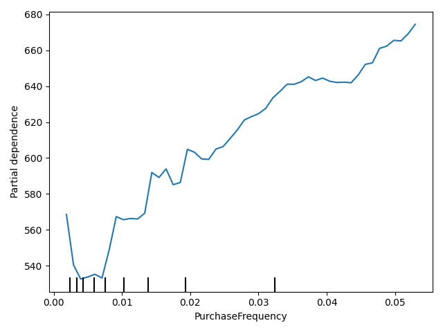

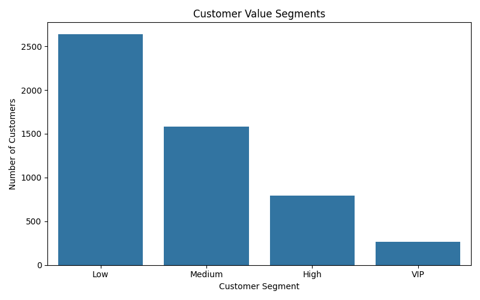

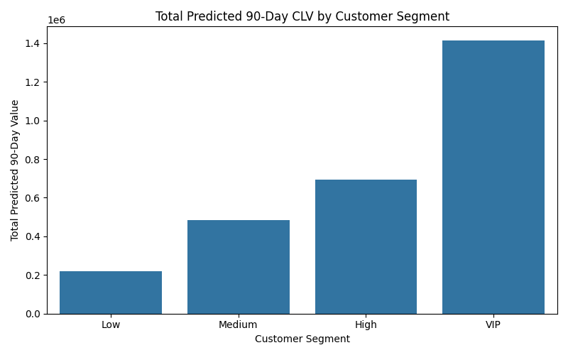

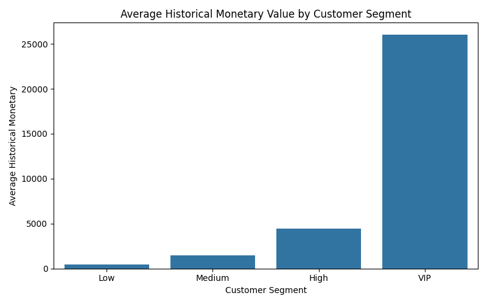

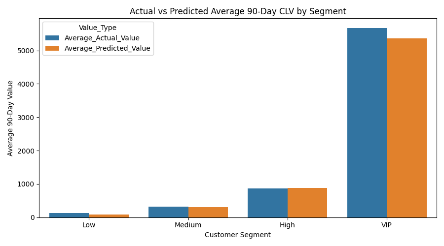

## Part 04 Output

The modelling notebook is:

```text
notebooks/04_model_tuning_interpretability_customer_value_analysis.ipynb
```

The customer scoring output is:

```text
data/processed/customer_clv_predictions.csv
```

The prediction CSV remains local because processed CSV files are ignored by `.gitignore`.

## Current Status

✅ **Part 01 - Data Understanding, Cleaning & Customer Behaviour Analysis is complete.**

✅ **Part 02 - Customer-Level Feature Engineering & CLV Target Creation is complete.**

✅ **Part 03 - CLV Prediction Model Development & Evaluation is complete.**

✅ **Part 04 - Model Tuning, Interpretability & Customer Value Analysis is complete.**

The CLV modelling, tuning, interpretability, and customer value analysis stages are complete.

## Project Structure

```text
customer-lifetime-value/
│
├── data/
│   ├── raw/
│   │   └── online_retail_dataset.xlsx
│   └── processed/
│       ├── cleaned_transactions.csv
│       ├── customer_clv_dataset.csv
│       └── customer_clv_predictions.csv
│
├── images/
│   ├── 01_monthly_revenue.png
│   ├── 02_monthly_active_customers.png
│   ├── 03_top_countries_by_revenue.png
│   ├── 04_monetary_distribution.png
│   ├── 05_future_90d_value_distribution.png
│   ├── 06_model_comparison_mae.png
│   ├── 07_model_comparison_rmse.png
│   ├── 08_model_comparison_r².png
│   ├── 09_random_forest_actual_vs_predicted.png
│   ├── 10_random_forest_feature_importance.png
│   ├── 11_tuned_rf_feature_importance.png
│   ├── 12_permutation_importance.png
│   ├── 13_partial_dependence_monetary.png
│   ├── 14_partial_dependence_recency.png
│   ├── 15_partial_dependence_purchase_frequency.png
│   ├── 16_customer_value_segments.png
│   ├── 17_predicted_clv_by_segment.png
│   ├── 18_historical_monetary_by_segment.png
│   └── 19_actual_vs_predicted_clv_by_segment.png
│
├── notebooks/
│   ├── 01_data_understanding_cleaning.ipynb
│   ├── 02_customer_level_feature_engineering.ipynb
│   ├── 03_clv_prediction_model.ipynb
│   └── 04_model_tuning_interpretability_customer_value_analysis.ipynb
│
├── README.md
├── SUMMARY.md
├── CHANGE_LOG.md
├── requirements.txt
└── .gitignore
```
